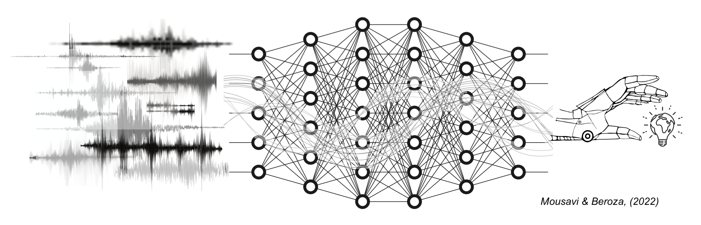

# [Deep Learning Seismology](https://smousavi05.github.io/dl_seismology/). 

## This repository contains the database and supporting materials for Deep Learning Seismology paper.

Free-Access Link to the Paper: https://www.science.org/stoken/author-tokens/ST-669/full

Seismic waves from earthquakes and other sources are used to infer the structure and properties of Earth’s interior. The availability of large-scale seismic datasets and the suitability of deep-learning techniques for seismic data processing have pushed deep learning to the forefront of fundamental, long-standing research investigations in seismology. However, some aspects of applying deep learning to seismology are likely to prove instructive for the geosciences, and perhaps other research areas more broadly. Deep learning is a powerful approach, but there are subtleties and nuances in its application. We present a systematic overview of trends, challenges, and opportunities in applications of deep-learning methods in seismology. The large amount and availability of datasets in seismology creates a great opportunity to apply machine learning and artificial intelligence to data processing. Mousavi and Beroza provide a comprehensive review of the deep-learning techniques being applied to seismic datasets, covering approaches, limitations, and opportunities. The trends in data processing and analysis can be instructive for geoscience and other research areas more broadly. —BG The ways in which deep learning can help process and analyze large seismological datasets are reviewed.

    article{
    doi:10.1126/science.abm4470,
    author = {S. Mostafa Mousavi  and Gregory C. Beroza },
    title = {Deep-learning seismology},
    journal = {Science},
    volume = {377},
    number = {6607},
    pages = {eabm4470},
    year = {2022},
    doi = {10.1126/science.abm4470},
    URL = {https://www.science.org/doi/abs/10.1126/science.abm4470},
    eprint = {https://www.science.org/doi/pdf/10.1126/science.abm4470},
    abstract = {}}
